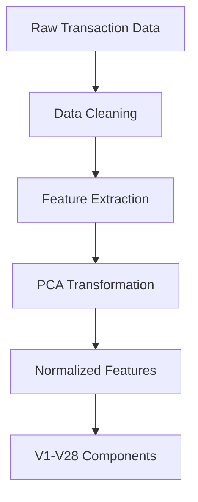

# Implementation Guide: Credit Card Fraud Detection

## Real-World Implementation Steps

### 1. Data Collection & Preprocessing
In a real production environment, you would collect:

- **Transaction Data:**
  - Amount
  - Time
  - Location
  - Merchant ID
  - Card Present/Not Present
  - Device Information

- **Customer Data:**
  - Transaction History
  - Account Age
  - Previous Fraud Cases
  - Behavioral Patterns

### 2. Feature Transformation Process



### 3. Integration Examples

#### Banking System Integration
```python
class BankingSystemIntegration:
    def process_transaction(self, transaction_data):
        # 1. Extract raw features
        raw_features = self.extract_features(transaction_data)
        
        # 2. Transform to PCA components (V1-V28)
        pca_features = self.pca_transform(raw_features)
        
        # 3. Get fraud prediction
        prediction = self.fraud_detector.predict(pca_features)
        
        # 4. Handle result
        if prediction == 1:
            self.trigger_fraud_alert(transaction_data)
        
        return prediction
```

#### Payment Gateway Integration
```python
class PaymentGateway:
    def process_payment(self, payment_info):
        # 1. Basic validation
        self.validate_payment(payment_info)
        
        # 2. Transform to model features
        features = self.prepare_features(payment_info)
        
        # 3. Check for fraud
        fraud_score = self.check_fraud(features)
        
        # 4. Apply business rules
        if fraud_score > self.threshold:
            return self.handle_suspicious_transaction()
        
        return self.process_normal_transaction()
```

### 4. Alert System Setup

#### Risk Levels and Actions
| Risk Score | Action | Response Time |
|------------|--------|---------------|
| 0.0 - 0.3  | Allow  | Immediate    |
| 0.3 - 0.7  | Review | < 30 mins    |
| 0.7 - 1.0  | Block  | Immediate    |

### 5. Monitoring Dashboard

Create a monitoring dashboard that shows:
- Real-time fraud detection rates
- False positive/negative rates
- Average response times
- System health metrics
- Model performance metrics

### 6. Business Rules Integration

Example of how to combine model predictions with business rules:

```python
def evaluate_transaction(transaction, model_prediction):
    # Model prediction (0 or 1)
    fraud_probability = model_prediction
    
    # Business rules
    rules_score = check_business_rules(transaction)
    
    # Combined decision
    final_score = combine_scores(fraud_probability, rules_score)
    
    return {
        "allow_transaction": final_score < THRESHOLD,
        "risk_score": final_score,
        "requires_review": REVIEW_THRESHOLD <= final_score < BLOCK_THRESHOLD,
        "action": determine_action(final_score)
    }
```

### 7. Performance Optimization

Tips for production deployment:
1. Use caching for frequent queries
2. Implement batch prediction for bulk processing
3. Set up model versioning
4. Create fallback mechanisms
5. Implement proper logging and monitoring

### 8. Testing in Production

Before full deployment:
1. Run A/B tests
2. Shadow testing
3. Gradual rollout
4. Performance testing
5. Load testing

### 9. Maintenance Schedule

Regular maintenance tasks:
- Daily: Monitor performance metrics
- Weekly: Analysis of false positives
- Monthly: Model retraining evaluation
- Quarterly: Comprehensive system review
