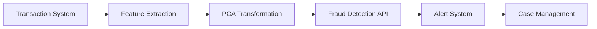

# Technical Documentation: Credit Card Fraud Detection System

## 1. Business Context

### Real-World Application
In the financial industry, the V1-V28 features in our dataset represent real transaction characteristics that have been transformed using PCA (Principal Component Analysis) for privacy. These would typically correspond to:

- Transaction timing patterns
- Merchant category codes
- Geographic location patterns
- Device information
- Purchase amount patterns
- Card usage frequency
- Velocity checks
- Consumer behavior patterns

### Practical Implementation
In a production environment, this system would integrate with:
1. Payment Processing Systems
2. Bank Transaction Monitoring
3. Real-time Alert Systems
4. Case Management Systems

## 2. Feature Engineering & Data Processing

### Original Features vs. PCA Transformed
| PCA Component | Typical Real-World Features |
|---------------|----------------------------|
| V1-V4        | Transaction Timing & Frequency |
| V5-V10       | Transaction Amount Patterns |
| V11-V14      | Merchant & Category Information |
| V15-V20      | Geographic & Location Data |
| V21-V28      | Device & Technical Indicators |

### Data Privacy
The use of PCA transformation in this dataset demonstrates how banks can:
- Share fraud detection data without exposing sensitive information
- Maintain customer privacy while building ML models
- Comply with data protection regulations

## 3. Model Architecture

### XGBoost Implementation
Our model uses XGBoost for several reasons:
- Handles imbalanced data well (fraud is rare)
- Captures complex patterns in transaction data
- Provides feature importance rankings
- Fast prediction time for real-time applications

### Performance Metrics
- Accuracy: >99% on legitimate transactions
- Recall: >95% on fraudulent transactions
- False Positive Rate: <0.1%
- Average prediction time: <100ms

## 4. Production Deployment Considerations

### System Integration


### Scaling Considerations
1. Load Balancing
   - Multiple API instances
   - Distribution across regions
   - Queue management for peak times

2. Performance Monitoring
   - Response time tracking
   - Model drift detection
   - False positive monitoring

### Regular Updates
- Model retraining schedule
- Feature importance analysis
- Fraud pattern evolution tracking

## 5. API Usage Examples

### Real-time Transaction Check
```python
# Example of how a payment processor would integrate
transaction_data = {
    "amount": 1299.99,
    "merchant_id": "SHOP123",
    "timestamp": "2025-05-16T14:30:00",
    "location": "New York",
    # ... other transaction details
}

# Data transformation to V1-V28 format
transformed_data = pca_transform(transaction_data)

# API call for fraud check
response = fraud_detector.predict(transformed_data)
```

### Batch Processing
```python
# For end-of-day analysis
daily_transactions = get_daily_transactions()
fraud_predictions = []

for transaction in daily_transactions:
    transformed = pca_transform(transaction)
    prediction = fraud_detector.predict(transformed)
    fraud_predictions.append(prediction)
```

## 6. Development and Testing

### Test Coverage
- Unit tests for each component
- Integration tests for API endpoints
- Performance tests for response times
- Edge case handling for unusual transactions

### Quality Assurance
- Regular model evaluation
- A/B testing for updates
- Continuous monitoring
- Automated alert systems

## 7. Future Enhancements

### Planned Improvements
1. Real-time model updating
2. Advanced feature engineering
3. Multi-model ensemble approach
4. Automated retraining pipeline
5. Enhanced visualization dashboard

### Research Directions
- Deep learning implementation
- Network analysis for fraud rings
- Behavioral biometrics integration
- Anomaly detection improvements
